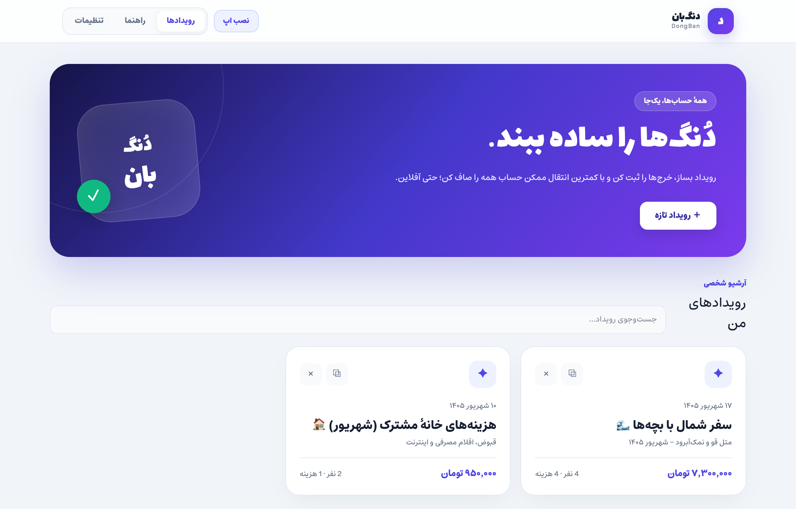
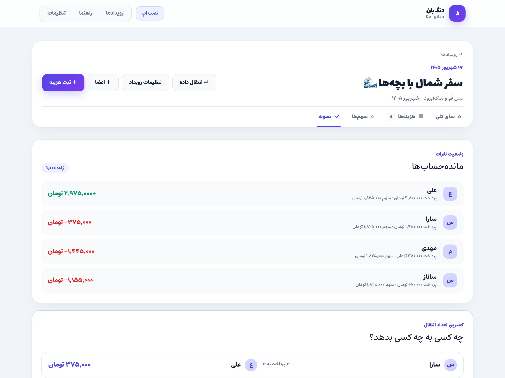
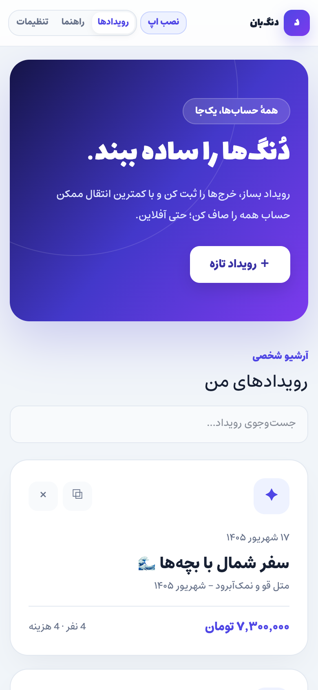
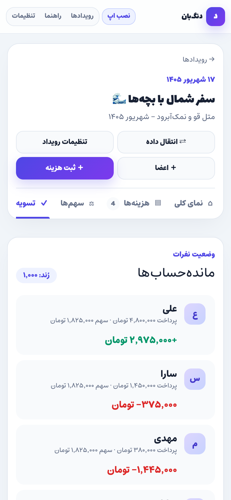

<div align="center">

# 🪙 دُنگ‌بان (DongBan)
### مدیریت و تسویه هوشمند و عادلانه هزینه‌های گروهی

**سفر رفتی؟ با بچه‌ها هم‌خانه‌ای؟ مهمانی یا کافه رفتی و سر حساب‌کتاب دنگ‌ها گیج شدی؟**  
دُنگ‌بان یک وب‌اپلیکیشن پیش‌رونده (PWA) مدرن، کاملاً **فارسی**، **آفلاین** و **متن‌باز** است که بدون نیاز به ثبت‌نام و اینترنت، هزینه‌ها را ثبت می‌کند و حساب همه را با کمترین تعداد کارت‌به‌کارت صاف می‌کند.

[](https://dongban.ir)
[](https://vuejs.org/)
[](https://tailwindcss.com/)
[](https://vitejs.dev/)
[](https://web.dev/progressive-web-apps/)
[](./LICENSE)

[🌐 نسخه آنلاین در dongban.ir](https://dongban.ir) • [📖 راهنمای تصویری استفاده](https://dongban.ir/guide) • [⭐ حمایت با ستاره دادن در گیت‌هاب](https://github.com/WhoisGray/DongBan)

---



</div>

---

## 🌟 چرا دُنگ‌بان؟

دیگر دوره‌ای که یکی توی گروه تلگرام می‌نوشت: *«علی ۵۰ تومن به من بده، من ۶۰ تومن به سارا بدم، سارا هم ۲۰ تومن به رضا بده»* تمام شد!

- ⚡ **۱۰۰٪ آفلاین و همیشه در دسترس**: در دل جنگل، کویر، جاده‌های شمال یا هواپیما که آنتن ندارید، دُنگ‌بان عین ساعت کار می‌کند.
- 🔒 **حریم خصوصی واقعی؛ بدون لاگین و سرور**: هیچ شماره موبایلی از شما پرسیده نمی‌شود؛ هیچ سروری دخل و خرج شما را ثبت نمی‌کند. تمام اطلاعات فقط روی دستگاه خودتان ذخیره می‌شود.
- 💳 **تشخیص هوشمند شماره کارت و شبا**: شماره کارت دوستت را بزن؛ دُنگ‌بان خودکار می‌فهمد برای کدام بانک است (بلوبانک، ملی، ملت، صادرات و...)، ۴ رقم ۴ رقم جدایش می‌کند و با لوگوی بانک تحویل می‌دهد.
- 📉 **کمترین تعداد جابه‌جایی پول**: با الگوریتم تسویه بدهی (Minimum Cash Flow)، به جای اینکه ۱۰ نفر به هم پول منتقل کنند، همه حساب‌ها تنها با ۲ یا ۳ کارت‌به‌کارت کاملاً صاف می‌شود!

---

## 📸 نگاهی به محیط برنامه

<div align="center">

### تسویه هوشمند و شماره حساب‌های جهت واریز


<br/>

### 📱 تجربه بی‌نقص در موبایل (PWA)
<p align="center">
  
  &nbsp;&nbsp;&nbsp;&nbsp;
  
</p>

</div>

---

## ✨ قابلیت‌های برجسته

### 🏖️ مدیریت رویدادهای نامحدود
- ساخت چند رویداد همزمان: سفر شمال، خانهٔ مشترک، دورهمی کافه، خرج‌های پروژه کاری.
- امکان جست‌وجوی سریع میان رویدادها و هزینه‌ها.
- امکان **تکثیر رویداد** (Duplicate): دورهمی تکراری با همان اعضا را در یک ثانیه دوباره شروع کنید.

### 💳 دفترچه مخاطبین و اطلاعات بانکی
- ذخیره شماره کارت و شماره شبای دوستان برای تمام رویدادها در حافظه مرورگر.
- **تشخیص خودکار نام و لوگوی بانک**: بلوبانک (`62198619`)، بانک ملی، ملت، صادرات، تجارت، پاسارگاد، سامان، پارسیان، سپه و تمام بانک‌های عضو شتاب.
- فرمت خودکار ۴ تا ۴ تا برای شماره کارت (`۶۰۳۷ ۹۹۱۱ ۲۲۳۳ ۴۴۵۵`) و پیشوند استاندارد شبا (`IR`).
- دکمه کپی سریع شماره کارت و شبا با یک لمس در موبایل.

### 🧮 محاسبه عادلانه با سهم‌های وزنی
- تقسیم مساوی بین همه اعضا یا اعضای منتخب.
- پشتیبانی از سهم‌های وزنی و اعشاری؛ مناسب برای بچه‌ها (۰٫۵ سهم)، افرادی که سفارش گران‌تری داشتند یا کسانی که مهمان بودند.
- تخصیص دقیق با روش *Largest Remainder* بدون حتی یک ریال کسری یا خطای اعشاری.

### 📅 تقویم شمسی اختصاصی
- انتخاب تاریخ کاملاً شمسی برای تمام رویدادها و هزینه‌ها.
- پشتیبانی از حالت راست‌به‌چپ (RTL) واقعی و باز شدن روان بدون بریده شدن صفحه در موبایل.

### 🎨 کارت تصویری تسویه برای شبکه‌های اجتماعی
- با زدن یک دکمه، تصویر رسمی و زیبایی از خلاصهٔ خرج‌ها، ماندهٔ هر نفر و شماره کارت‌های طلبکاران ساخته می‌شود.
- مناسب برای ارسال مستقیم در گروه‌های تلگرام، واتساپ، بله، ایتا یا استوری اینستاگرام.

### 📊 خروجی و ورودی کامل Excel و JSON
- دانلود فایل کامل اکسل (`.xlsx`) راست‌چین و فرمول‌دار شامل شیت‌های: راهنما، رویداد، اعضا، هزینه‌ها، سهم‌ها، مادرخرج‌ها، خلاصه افراد و تسویه‌ها.
- امکان ارسال فایل اکسل یا JSON برای شخص دیگر جهت ادامه‌دادن ثبت خرج‌ها روی گوشی خودش.
- سازگار با **هوش مصنوعی**: پرامپت آماده برای ChatGPT و Claude تا فاکتورها را خودکار به فایل اکسل دُنگ‌بان تبدیل کنند!

### 📱 وب‌اپلیکیشن پیش‌رونده (PWA)
- امکان نصب مستقیم روی آیفون، آیپد، اندروید، مک و ویندوز بدون نیاز به اپ‌استور یا بازار.
- انیمیشن‌های روان و فوق‌العاده سبک با شتاب سخت‌افزاری ۶۰ فریم بر ثانیه (بدون داغ کردن یا کندی گوشی).
- دارای دو تم چشم‌نواز **تاریک (Dark)** و **روشن (Light)**.

---

## 🚀 نصب و اجرای محلی (ویژه توسعه‌دهندگان)

### نیازمندی‌ها
- **Node.js** نسخهٔ `20.19.0` یا بالاتر
- **npm** نسخهٔ `10` یا بالاتر

### راه‌اندازی سریع

```bash
# ۱. دریافت کد پروژه
git clone https://github.com/WhoisGray/DongBan.git
cd DongBan

# ۲. نصب پکیج‌ها
npm install

# ۳. اجرای محیط توسعه
npm run dev
```

سپس آدرس نمایش داده شده (معمولاً `http://localhost:5173`) را در مرورگر باز کنید.

### اسکریپت‌های موجود

```bash
npm run dev       # اجرای سرور توسعه Vite با Hot Module Replacement
npm run build     # ساخت خروجی نهایی برای پروداکشن در پوشه dist
npm run preview   # پیش‌نمایش خروجی بیلد پروداکشن
npm test          # اجرای تست‌های واحد با Vitest
npm run lint      # بررسی کدها با ESLint و استانداردها
```

---

## 🐳 اجرا با Docker

اگر می‌خواهید دُنگ‌بان را روی سرور شخصی یا سرور خانگی (Self-host) اجرا کنید:

```bash
docker compose up -d --build
```

برنامه روی پورت `8080` (آدرس `http://localhost:8080`) با وب‌سرور سبک Nginx و کش بهینه در دسترس خواهد بود.

---

## 📲 راهنمای نصب روی گوشی

<details>
<summary><b>🍏 نصب روی iPhone و iPad (iOS)</b></summary>

1. سایت [dongban.ir](https://dongban.ir) را در مرورگر **Safari** باز کنید.
2. دکمهٔ **Share** (مربع با فلش رو به بالا) را در پایین صفحه لمس کنید.
3. به پایین اسکرول کرده و گزینهٔ **Add to Home Screen** را انتخاب کنید.
4. دکمهٔ **Add** را در بالای صفحه بزنید. آیکون دُنگ‌بان روی صفحهٔ اصلی شما اضافه شد!
</details>

<details>
<summary><b>🤖 نصب روی گوشی‌های Android</b></summary>

1. سایت [dongban.ir](https://dongban.ir) را در مرورگر **Chrome** باز کنید.
2. روی دکمهٔ **«نصب اپ»** بالای صفحه بزنید یا از منوی ۳ نقطه مرورگر، گزینهٔ **Install app** یا **Add to Home screen** را انتخاب کنید.
</details>

---

## 🤝 مشارکت در توسعه (Contributing)

دُنگ‌بان یک پروژهٔ جامعه‌محور و متن‌باز است. هرگونه کمک شامل گزارش باگ، پیشنهاد قابلیت جدید، بهبود طراحی یا ارسال Pull Request با آغوش باز استقبال می‌شود!

1. این مخزن را **Fork** کنید.
2. شاخهٔ ویژگی جدید خود را بسازید: `git checkout -b feature/amazing-feature`
3. تغییرات خود را ثبت کنید: `git commit -m 'Add amazing feature'`
4. شاخه را ارسال کنید: `git push origin feature/amazing-feature`
5. یک **Pull Request** باز کنید.

---

## ⭐ حمایت از پروژه

اگر دُنگ‌بان کار شما را در سفرها یا دورهمی‌ها راحت کرده، با **دادن یک ستاره (Star ⭐)** در بالای همین صفحه گیت‌هاب و معرفی آن به دوستانتان از این ابزار آزاد ایرانی حمایت کنید.

---

## 📄 مجوز (License)

این پروژه تحت مجوز **MIT** منتشر شده است. برای جزئیات بیشتر فایل [LICENSE](./LICENSE) را مشاهده کنید.
